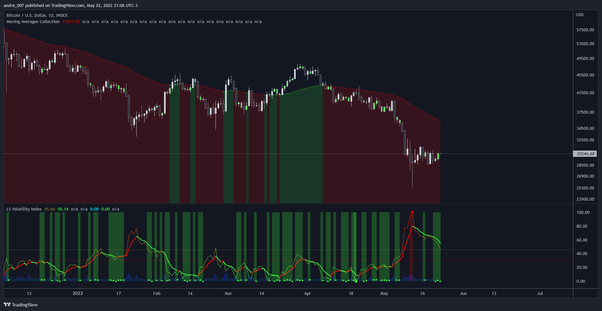
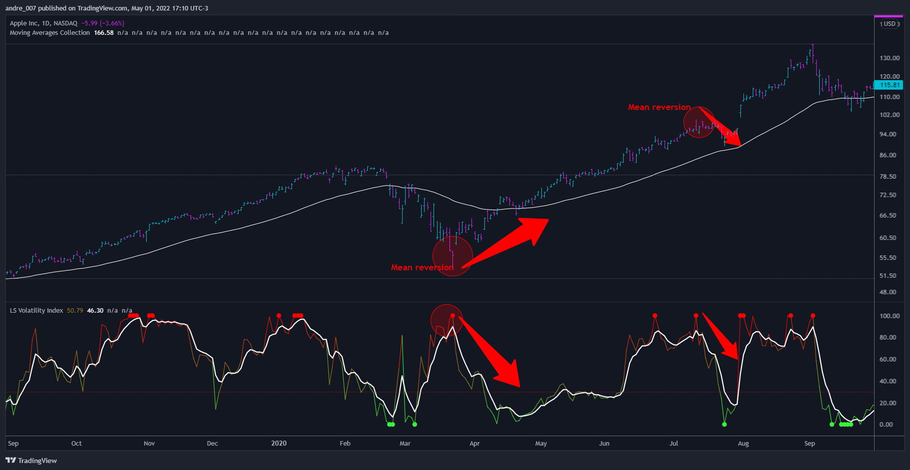
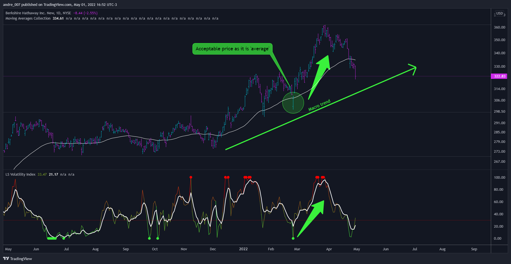
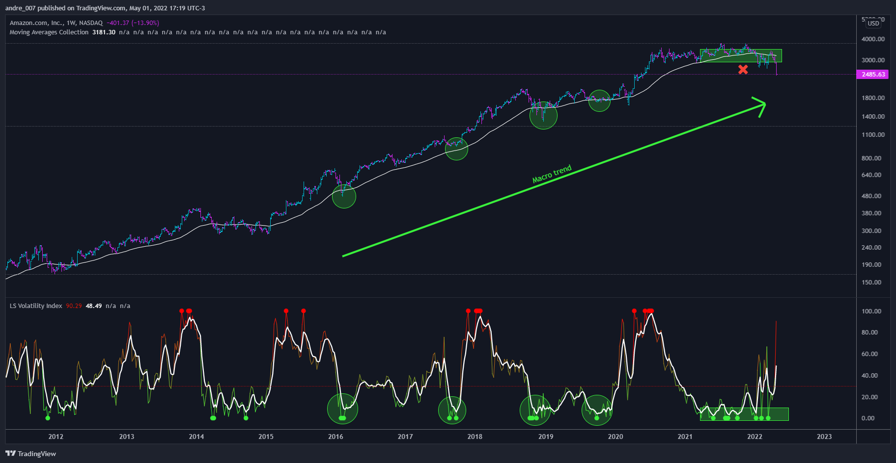
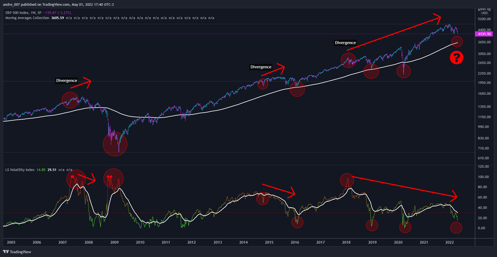
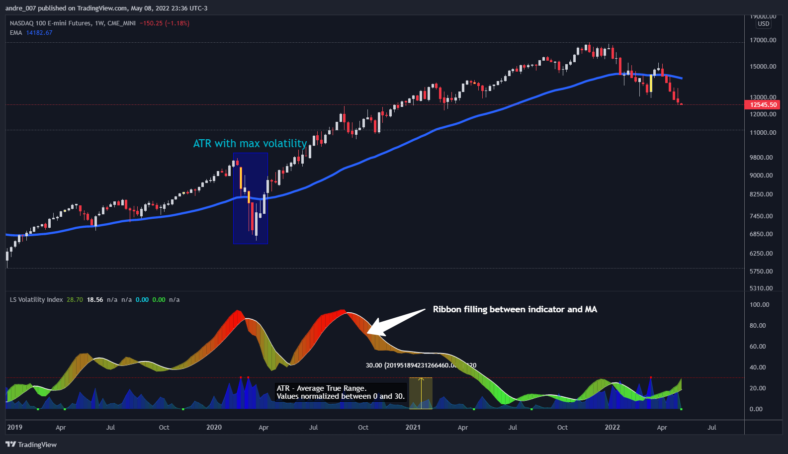

# LS Volatility Index
The LS Volatility Index is a technical trading analysis indicator, which can be used in the stock market, commodities, forex, crypto assets, futures, or anything that is traded in the financial market.

Basically it serves to measure the volatility of the price in relation to a pre-defined moving average.

## █  Goals

It serves four purposes:

1. Identify abnormal prices, extremely stretched in relation to an average;
2. Identify acceptable prices in the context of the main trend;
3. Identify market crashes;
4. Identify divergences.

## █  CONCEPTS

The LS Volatility Index was originally described by Brazilian traders *Alexandre Wolwacz (Stormer)*, *Fabrício Lorenz*, and *Fábio Figueiredo (Vlad)*.

Basically, this indicator can be used in two ways:

1. In a **mean reversion strategy**, when there is an unusual distance from it;
2. In a **trend following strategy**, when the price is in an acceptable region.

Perhaps the version presented here may have some slight differences, but the core is the same.

The original indicator is presented with a 21-period moving average, but here this value is customizable.

I made some fine tuning available, namely:

1. The possibility of smoothing the indicator;
2. Choose the type of moving average;
3. Customizable period;
4. Possibility to show a moving average of the indicator;
5. Color customization and some extras.

## █  CALCULATION

First, the distance of the price from a given average in percentage terms is measured.

Then, the historical average volatility is obtained.

Finally the indicator is calculated through the ratio between the distance and the historical volatility .

To facilitate visualization, the result is normalized in a range from 0 to 100.

When it reaches 0, it means the price is on average.

When it hits 100, it means the price is way off average (stretched).

## █  HOW TO USE IT

Here are some examples:

1. In a return-to-average strategy

2. In a trend following strategy
   

3. Identification of crashes and divergences

## Extras

Added some extras to the original indicator. 

In a nutshell, the image bellow explains:

### 1. ATR (Average True Range)

Added the ability to view ATR volatility in relation to historical volatility.

In a nutshell, this shows how large the candlestick's amplitude is compared to the past average amplitude.

An example is found in the graphs below, in the blue area that goes from 0 to 30.

*The reason for the addition:*

Originally the LS indicator does not have this feature.
I added ATR as an auxiliary tool, to have an overview of volatility,
not being restricted only to volatility in relation to a moving average.

The ATR can be hidden if you don't find this information relevant.

Here, the ATR values ​​are normalized in the range from 0 to only 30, in order not to pollute the main indicator, which is the LS Volatility Index.

Remembering that the red line at 30 is inherent in LS.
An LS with a value above 30 indicates a price possibly far from the average, while an LS with a value below 30 indicates a price close to the average.

### 2. Ribbon filling

There is a possibility to place a colored background between the indicator and the indicator average.

### 3. Color bar
There is a possibility to change the bar color when the index reaches the limits. This functionality appear when the parameter "Change bar color when indicator reaches limit" is activated.

The special color of parameter will only be valid when the candle is confirmed, in order to avoid visual pollution and premature information.

## █  Caution

No technical indicators are 100% accurate as they can sometimes generate false signals.

You should never rely on a single indicator and always use a range of them when making trading decisions.

## █  THANKS AND CREDITS

- Alexandre Wolwacz (Stormer), Fabrício Lorenz, Fábio Figueiredo (Vlad)
- Feature scaler (for normalization)
- HPotter (for calc of Historical Volatility )

## █  DONATIONS

- BTC: 3AK6MxX93czQraP4AFv1wKYDvPnPipgF51
- LTC: MBabKb6vedx3UsxTwMJCPPjKdLJSr6dczS
- Dash: XcmdgWfnNQeJEJhkd6pUaaQpmT3AiA98QA